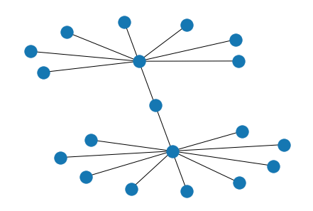
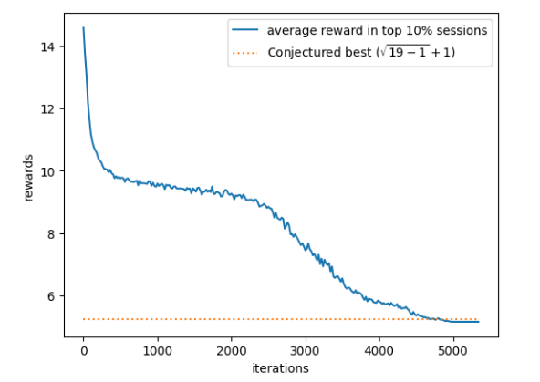
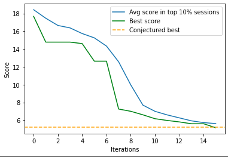

Results
================

I ran the algorithm on the following two scoring functions, and had interesting results for each one.

Conjecture 1
------------
**See the Python Notebook for this Conjecture on** `Colab <https://colab.research.google.com/drive/1fj8y-G4_HgCPyOhx_eBqzrwzMVKugAT4?usp=sharing>`_

Let G be a connected graph with N nodes. Let the largest eigenvalue of G's adjacency matrix be ƛ. Let the `matching number\ <https://en.wikipedia.org/wiki/Matching_(graph_theory)>`_
of G (i.e. size of the maximum matching in G) be μ. Then the bound is simply that ƛ + μ > 1 + √(n-1).

We can therefore let **f**\ (G) = ƛ + μ, and apply the algorithm on **f** to try and break the bound 1 + √(n-1).

Results
^^^^^^^
Here's the counterexample detected by my algorithm for N=19:

    Counterexample to Conjecture 1

For a reference point, I will first list some statistics of how Wagner's work ran. Wagner's program took a few hours to discover a counterexample running on a normal system.
It took around 5000 iterations of the loop, with 1000 graphs constructed per iteration.

My program took around 5 minutes to find the counterexample, running on Colab. It took around 14 iterations (a 35m0x improvement),
with only 200 graphs constructed per iteration (5x less data per iteration).

    [Wagner]_ (above) and my algorithm's diagram

Conjecture 2
------------
**See the Python Notebook for this Conjecture on** `Colab <https://colab.research.google.com/drive/1mkmT_U5GWB3c65sG8sYx734cFQWeZs7X?usp=sharing>`_

Let G be a connected graph with N nodes. I'll outline a few separate concepts that are required to understand this conjecture:

The Distance Matrix D is an n x n matrix where D[i][j] is equal to the length of the shortest path between i and j in G.
Let the distance matrix's eigenvalues of G be in the array Q where Q[1] >= Q[2] >= ... >= Q[n].

Let the E[i] just be the sum of D[i][j] for all elements j, so E[i] is the sum of distances from i to every vertex. Then proximity of G, π, is given by E[x]/(n-1),
where x is the index of the minimum element of E. Intuitively, proximity represents how closely packed together the graph is.

Let F be the diameter of the graph, i.e. the maximum element in D or the longest shortest path in G.

Then the following conjecture has actually been proved: For any tree G: π + Q[⌊F/2⌋] > 0.

The conjecture Wagner provides a counterexample for in his paper, is a considerably stronger one. For any connected graph G: π + Q[⌊2D/3⌋] > 0.

Results
^^^^^^^

    Counterexample to Conjecture 2

My paper, within an hour or so, found an extremely simple counterexample, the complete graph. In fact, since the complete graph has a diameter of 1, it actually invalidates the problem
entirely since there is no eigenvalue defined at Q[⌊2D/3⌋] = Q[0]. Even with a small amendment, to round up to 1 when D=1, the complete graph is still a counterexample to the paper.

For reference, after a few days of running, Wagner's algorithm got close to a more complicated counterexample, which Wagner then used as information to develop the actual counterexample. I can
amend my algorithm to ignore complete graphs, and I am certain it would also reach the counterexample Wagner's algorithm got to, but I am unable to due to lack of access to computing power.

With regards to the counterexample invalidating the conjecture, I emailed Wagner, and he confirmed my suspicion that the conjecture was indeed invalid, and could be amended by my suggestion.
The issue is that Wagner cited a relatively famous published paper, that also made this mistake. Their mistake originated from a misreading of an even more famous paper, which only proved
the theory I mentioned in Conjecture 2 for Trees, and not for all connected graphs.
